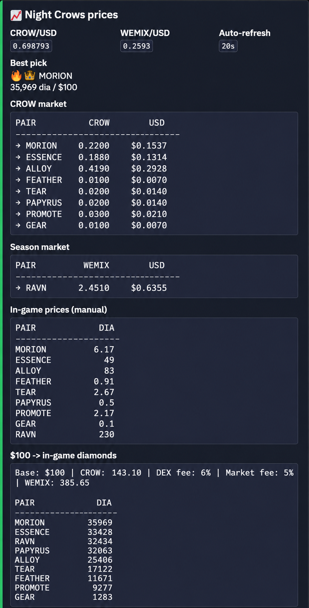

# NC Market Terminal

Discord bot and price feeder for **Night Crows** market monitoring on PNIX (WEMIX).

## Preview



## Overview

NC Market Terminal collects live DEX prices via WebSocket, writes a shared `prices.json`, and displays a auto-updating Discord price card with conversion estimates from USD to in-game diamonds.

Two processes:

- **feeder.py** — WebSocket + HTTP price collection
- **bot.py** — Discord bot, slash commands, price card

## Features

- PNIX WebSocket feed (main + season gateways)
- CROW/USD (GeckoTerminal) and WEMIX/USD (multiple exchanges)
- Auto-updating Discord price card (single message, edit in place)
- Manual in-game market prices (`ingame_prices.json`)
- USD → resource → diamonds conversion estimate
- Slash commands: `/prices_now`, `/prices_refresh`, `/market`, `/sm`, `/bulkmarket`, `/scan_price`
- OCR market screenshot scan (beta, optional Tesseract)

## Architecture

```
feeder.py  →  prices.json  →  bot.py  →  Discord
                  ↑
         ingame_prices.json (manual prices)
```

| Module | Role |
|--------|------|
| `feeder.py` | WebSocket subscriptions, USD refs, `prices.json` writer |
| `bot.py` | Discord commands, price card lifecycle |
| `formatter.py` | Embed layout, conversion tables |
| `prices_io.py` | JSON file read/write |
| `ocr_scan.py` | Screenshot OCR (beta) |
| `settings.py` | Paths and `.env` config |

## Commands

| Command | Description |
|---------|-------------|
| `/prices_now` | Show current prices embed |
| `/prices_refresh` | Refresh price card (officers) |
| `/market` | Show manual in-game prices |
| `/sm` | Set one resource price in diamonds |
| `/bulkmarket` | Bulk update in-game prices |
| `/scan_price` | OCR scan of market screenshot (beta) |
| `/prices_template` | Template for `/bulkmarket` |

See [docs/COMMANDS.md](docs/COMMANDS.md) for details.

## Price Feed

The feeder connects to PNIX WebSocket gateways and subscribes to market snapshots. It refreshes CROW/USD and WEMIX/USD on a timer and writes `prices.json` atomically.

See [docs/PRICE_FEED.md](docs/PRICE_FEED.md).

## Discord Price Card

When `PRICES_ENABLED=true` and `PRICES_CHANNEL_ID` is set, the bot maintains **one** message in the channel and edits it on each refresh.

## OCR Market Scan

Optional beta feature using Tesseract (`pytesseract`). Requires system `tesseract-ocr` with `eng` and `rus` languages.

See [docs/OCR.md](docs/OCR.md).

## Configuration

Copy `.env.example` to `.env` and fill in values:

```bash
cp .env.example .env
```

Required:

- `DISCORD_TOKEN` — Discord bot token
- `PRICES_CHANNEL_ID` — channel ID for the price card (optional but recommended)

See [docs/SETUP.md](docs/SETUP.md).

## Local Setup

```bash
python -m venv .venv
.venv\Scripts\activate          # Windows
# source .venv/bin/activate     # Linux/macOS

pip install -r requirements.txt
cp .env.example .env
# Edit .env with your token and channel ID
```

**Tesseract (optional, for OCR):**

- Windows: install from [UB Mannheim tesseract](https://github.com/UB-Mannheim/tesseract/wiki)
- Ubuntu: `sudo apt install tesseract-ocr tesseract-ocr-eng tesseract-ocr-rus`

## Running

Terminal 1 — price feeder:

```bash
python feeder.py
```

Terminal 2 — Discord bot:

```bash
python bot.py
```

Start the feeder first so `prices.json` exists before the bot reads it.

## Project Structure

```
nc_market_terminal/
├── bot.py              # Discord bot entry point
├── feeder.py           # Price feeder entry point
├── formatter.py        # Embed formatting
├── prices_io.py        # JSON I/O
├── ocr_scan.py         # OCR (beta)
├── settings.py         # Config
├── requirements.txt
├── .env.example
├── docs/
├── data/               # runtime (gitignored)
├── prices.json         # runtime (gitignored)
└── ingame_prices.json  # runtime (gitignored)
```

## Safety / Secrets

**Never commit:**

- `.env`, `token.txt`, or any file with Discord tokens
- `prices.json`, `ingame_prices.json`, `data/` (runtime state, channel/message IDs)

The bot reads `DISCORD_TOKEN` only via `os.getenv("DISCORD_TOKEN")` in `settings.py`.

See [docs/SECURITY.md](docs/SECURITY.md).

## Troubleshooting

| Issue | Check |
|-------|-------|
| Bot exits: no token | `DISCORD_TOKEN` in `.env` |
| Card not updating | `PRICES_ENABLED`, `PRICES_CHANNEL_ID`, feeder running |
| Empty prices | `feeder.py` running, `PRICES_JSON_PATH` correct |
| OCR fails | Tesseract installed, `eng+rus` languages |
| New messages every refresh | `data/prices_card_only.json` state; bot should edit one message |

## License

MIT — see [LICENSE](LICENSE). Copyright (c) 2026 den775.
